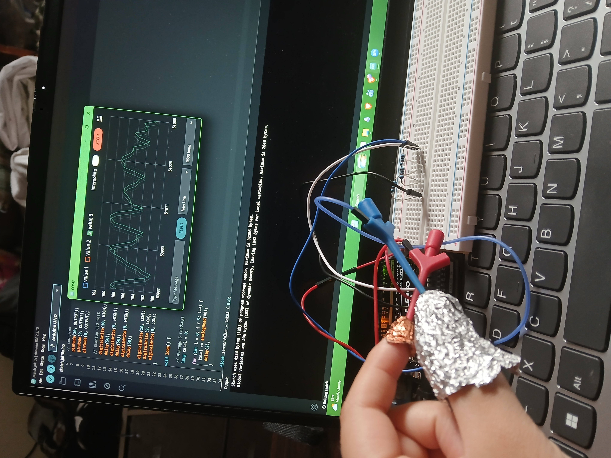

# Yaretzi's electrodermal lie detector journey

The electrodermal lie detector uses galvanic skin response (GSR) and a polygraph to help determine if the person being trialed is telling the truth or not through the use of sweat and skin activity. It can also keep track of the persons pulse rate to also help determine if the person is lying.  

You should comment out all portions of your portfolio that you have not completed yet, as well as any instructions:
```HTML 
<!--- This is an HTML comment in Markdown -->
<!--- Anything between these symbols will not render on the published site -->
```

| **Engineer** | **School** | **Area of Interest** | **Grade** |
|:--:|:--:|:--:|:--:|
| Yaretzi H | KIPP College Prep | Biomedical Engineering | Incoming Sophmore



# Final Milestone

**Don't forget to replace the text below with the embedding for your milestone video. Go to Youtube, click Share -> Embed, and copy and paste the code to replace what's below.**

<iframe width="560" height="315" src="https://www.youtube.com/embed/F7M7imOVGug" title="YouTube video player" frameborder="0" allow="accelerometer; autoplay; clipboard-write; encrypted-media; gyroscope; picture-in-picture; web-share" allowfullscreen iframe>

For your final milestone, explain the outcome of your project. Key details to include are:
- What you've accomplished since your previous milestone
- What your biggest challenges and triumphs were at BSE
- A summary of key topics you learned about
- What you hope to learn in the future after everything you've learned at BSE


# Second Milestone

**Don't forget to replace the text below with the embedding for your milestone video. Go to Youtube, click Share -> Embed, and copy and paste the code to replace what's below.**

<iframe width="560" height="315" src="https://www.youtube.com/embed/y3VAmNlER5Y" title="YouTube video player" frameborder="0" allow="accelerometer; autoplay; clipboard-write; encrypted-media; gyroscope; picture-in-picture; web-share" allowfullscreen <iframe>

For your second milestone, explain what you've worked on since your previous milestone. You can highlight:
- Technical details of what you've accomplished and how they contribute to the final goal
- What has been surprising about the project so far
- Previous challenges you faced that you overcame
- What needs to be completed before your final milestone 

# First Milestone 

<iframe width="560" height="315" src="https://www.youtube.com/embed/weRS4PkNmuc?si=7dlC6ik-W7aeEUK2" title="YouTube video player" frameborder="0" allow="accelerometer; autoplay; clipboard-write; encrypted-media; gyroscope; picture-in-picture; web-share" referrerpolicy="strict-origin-when-cross-origin" allowfullscreen></iframe>

# Schematics 
Here's where you'll put images of your schematics. [Tinkercad](https://www.tinkercad.com/blog/official-guide-to-tinkercad-circuits) and [Fritzing](https://fritzing.org/learning/) are both great resoruces to create professional schematic diagrams, though BSE recommends Tinkercad becuase it can be done easily and for free in the browser. 

# Code

float filteredValue = 0;

void setup() {
  Serial.begin(9600);

  // LED pins
  pinMode(10, OUTPUT);
  pinMode(9, OUTPUT);
  pinMode(8, OUTPUT);

  // Startup LED test
  digitalWrite(10, HIGH);
  delay(50);
  digitalWrite(9, HIGH);
  delay(50);
  digitalWrite(8, HIGH);
  delay(50);

  digitalWrite(10, LOW);
  digitalWrite(9, LOW);
  digitalWrite(8, LOW);
}

void loop() {

  // Average 5 readings
  long total = 0;

  for (int i = 0; i < 5; i++) {
    total += analogRead(A0);
    delay(2);
  }

  float sensorValue = total / 5.0;

  // Light smoothing (more responsive)
  filteredValue = 0.70 * filteredValue + 0.30 * sensorValue;

  // LED indicators
  digitalWrite(10, filteredValue > 300);
  digitalWrite(9, filteredValue > 600);
  digitalWrite(8, filteredValue > 900);

  // Serial Plotter scale
  Serial.print(95);
  Serial.print(",");
  Serial.print(115);
  Serial.print(",");
  Serial.println(filteredValue);

  delay(50);
}
# Bill of Materials

| **Part** | **Note** | **Price** | **Link** |
|:--:|:--:|:--:|:--:|
| Arduino Uno | Used for reading inputs such as messages and turn it into outputs that help power your device, project and system  | $300 | <a href="https://www.amazon.com/ELEGOO-Board-ATmega328P-ATMEGA16U2-Compliant/dp/B01EWOE0UU/ref=sims_dp_d_dex_ai_rank_model_1_d_v1_d_sccl_1_2/131-0474986-0583845?pd_rd_w=30Dnf&content-id=amzn1.sym.bb4a0aac-c2b4-4b4b-a0c8-9aa89b28dce3&pf_rd_p=bb4a0aac-c2b4-4b4b-a0c8-9aa89b28dce3&pf_rd_r=4M85MYH929P05F0S87WE&pd_rd_wg=mQCZ8&pd_rd_r=f31547c7-ca98-4c5b-8d6c-de526028cac2&pd_rd_i=B01EWOE0UU&psc=1"> Link </a> |
| Buzzer/LED/Vibrtion | helps light up your project or used for display |$6.55 | <a href="https://www.amazon.com/s?k=led&i=industrial&crid=16ERNF7Q0TF4J&sprefix=LED%2Cindustrial%2C139&ref=nb_sb_ss_p13n-expert-pd-ops-ranker_ci_hl-bn-left_1_3"> Link </a> |
| copper tape| used to help transfer heat, electricity and radio frequency | $8 | <a href="https://www.amazon.com/Kirecoo-Conductive-Shielding-Electrical-Grounding/dp/B09Z6F9RFG/ref=sr_1_3?crid=1B68CK1WOG3P4&dib=eyJ2IjoiMSJ9.XmUtSyIic8_E3Qr4oK0quFqV9fQ6eofMY8kCHCHy57CcqSmDx18Rf31a90Wv61yYUJ4oaqIZZuwm00UHEMmgEWCulK4Jwb5SZQ-ykWRvnCuBjgLGfe22nfYrrBYvTholtkBaGdWaXhofmMy6LLKxkloBLb-N-xGERRh2ZG7z5kaYjcv5CgjAku5dh2hnZTclk10pyIZTSwNo9yHlWLbWey_m3_xOx2zASkp4Zv2CFBv3AkFwcgKYXTqSkg6s4q0bauvDUCmrjmCl9q6HQIdpmTvQgNWxRjzyW_4M-Y6yUgw.a_KhWh2DD4US_KU9CUpbV1ySZoJ660q5hhSOkaY1IEE&dib_tag=se&keywords=copper+tape&qid=1783525907&s=industrial&sprefix=copper+%2Cindustrial%2C113&sr=1-3"> Link </a> |
| aluminum| used for building, wiring and transfering power  | $5.67 | <a href="https://www.amazon.com/Reynolds-Wrap-Heavy-Strength-50/dp/B00279LYL6/ref=sr_1_8?dib=eyJ2IjoiMSJ9.cHXovjINofGmqe7Oson_QernHShvUr9tUGkBzrTrGYsHdb_JAbNu03pJZ8C97m29xVM6vHcRB0A1TX7I66NU4fZhrTEuuFcCIuiDqE5nOT3C4ICc8EZSCLZB8fSR-ay7UD2z50VxJLR5VPDkt2kDXMN_rZ2rrcsgatqCzrs62yvbTjvJ1i0aI-LsE5034A9fZWcNYVMQKiKdOmcIgdZkfIEu2hnddZOE_F_mfGgeNRwvVsQ-x6kx2e3kF3i75NwM2zDXRc0h7GBBL6GRdVH-X98kdzNZx-dFyL4bv03kUsw.Z-Gg9cga0WokVBZqyMMUJvnEHKdmWwFspmf1RhqRmTs&dib_tag=se&keywords=aluminum%2Bfoil&qid=1783527530&rdc=1&sr=8-8&th=1"> Link </a> |


# Other Resources/Examples
One of the best parts about Github is that you can view how other people set up their own work. Here are some past BSE portfolios that are awesome examples. You can view how they set up their portfolio, and you can view their index.md files to understand how they implemented different portfolio components.
- [Example 1](https://trashytuber.github.io/YimingJiaBlueStamp/)
- [Example 2](https://sviatil0.github.io/Sviatoslav_BSE/)
- [Example 3](https://arneshkumar.github.io/arneshbluestamp/)

To watch the BSE tutorial on how to create a portfolio, click here.
